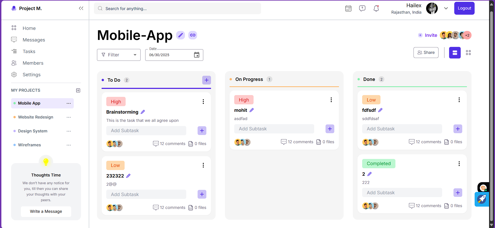
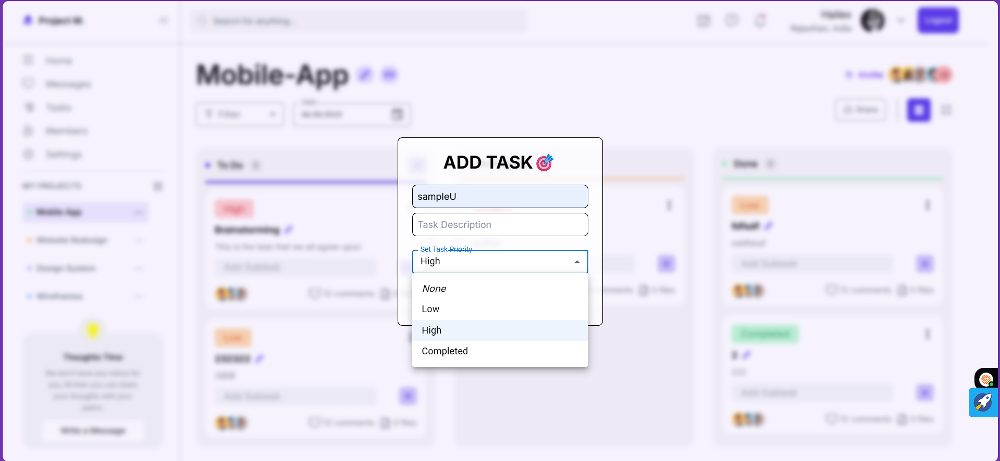
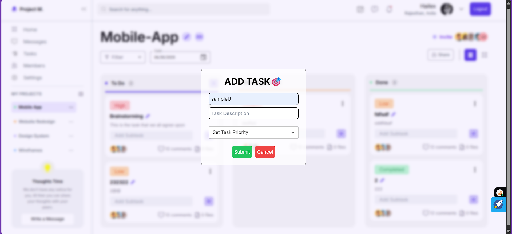
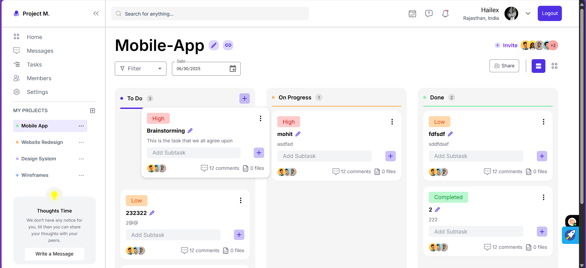
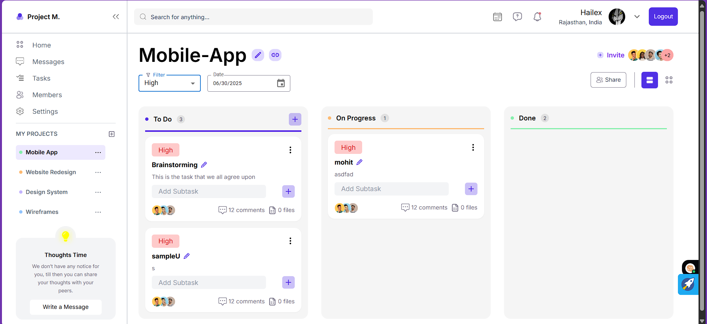
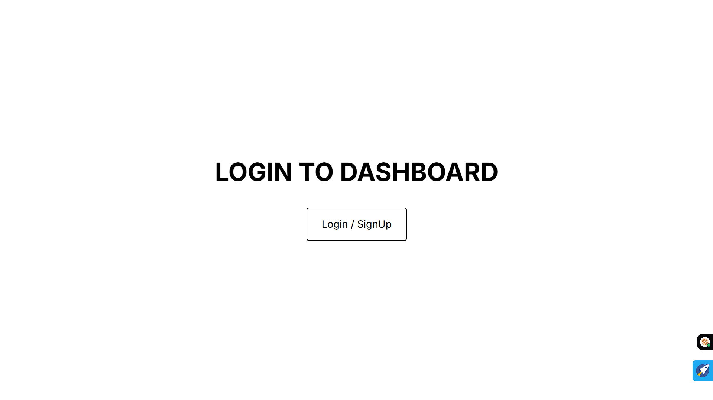
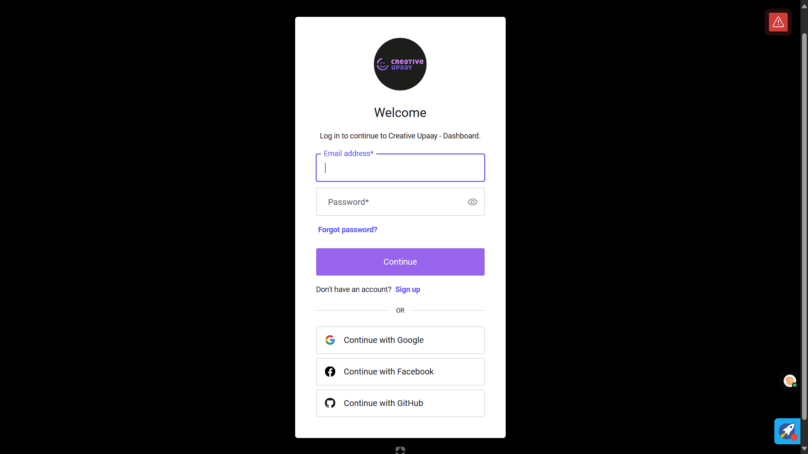
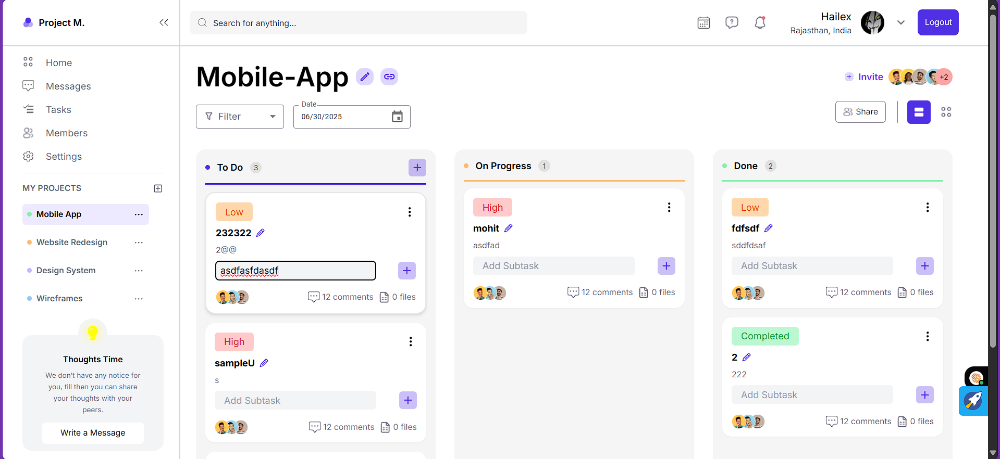

# 🎨 Creative Upaay Dashboard

🌐 [Live Demo](https://creative-upaay-dashboard.netlify.app/)  
📦 Full Stack Assignment | 🛠️ Auth0 + Redux + Drag & Drop + Subtasks

Welcome to the Creative Upaay Full Stack Assignment repository! This dashboard showcases modern frontend development using **React**, **Redux**, **Material UI**, **Tailwind CSS**, and **Auth0** for authentication.  
I have completed **all Level 1 functionalities** and implemented key features from **Level 2**, including **basic authentication** and **subtasks**.

---

## 📑 Assignment Overview

> The assignment consists of two levels.  
> ✅ Level 1 – Compulsory  
> ⭐ Level 2 – Optional but adds bonus points!

---

### ✅ Level 1 Functionalities (Implemented)

1. **🎨 Figma-Based UI Implementation**  
   - Fully responsive layout using **Material UI** + **Tailwind CSS**  
   - 3-column dashboard: `To Do`, `In Progress`, `Done`

2. **📝 Task Management**  
   - Add new tasks dynamically with title & description  
   - Move tasks between stages with drag-and-drop

3. **🔍 Task Filtering**  
   - Keyword-based filtering using task title and description

4. **🧠 State Management**  
   - Powered by **Redux Toolkit**  
   - State persisted in **LocalStorage**

5. **🧲 Drag and Drop**  
   - Implemented with `react-beautiful-dnd` for smooth transitions

---

### ⭐ Level 2 Functionalities (Partially Implemented)

| Feature                        | Status    | Details |
|-------------------------------|-----------|---------|
| ✅ Basic Authentication       | Completed | Secured with **Auth0** |
| ✅ Subtasks per Task          | Completed | Each task supports nested subtasks |
| ✅ Custom Task Fields         | Added Custom Tasks such as Priority Levels |
| ❌ Due Date & Reminder        | Not implemented |
| ❌ Socket.io Real-Time Sync   | Not implemented |
| ❌ Activity Log               | Not implemented |

> ✅ 3 out of 6 Level 2 features done. Working towards implementing more!

---

## 📽️ Demo & Screenshots

### 📍 Dashboard Overview


*The main dashboard UI with three stages: To Do, In Progress, and Done.*

---

### 📝 Add Task Modal



*A modal interface for adding a new task with title and description.*

---

### 🔁 Drag & Drop in Action


*Tasks being dragged and dropped smoothly between different sections.*

---

### 🔍 Task Filtering Feature



*Live filtering of tasks based on keywords or categories.*

---

### 🔐 Auth0 Login Flow



*Secure authentication using Auth0 - login screen with social options.*

---

### 🪜 Subtasks View


*Expanded task view showing nested subtasks under a parent task.*


---

## 🛠️ Tech Stack

| Category           | Tech Used |
|--------------------|-----------|
| **Framework**      | React.js |
| **Styling**        | Tailwind CSS + Material UI |
| **State Management** | Redux Toolkit |
| **Auth**           | Auth0 |
| **Drag & Drop**    | react-beautiful-dnd |
| **Persistence**    | LocalStorage |
| **Deployment**     | Netlify |

---

## 📂 Folder Structure

```bash
📁 src
├── components/       # UI components like TaskCard, Column, Modal, etc.
├── assets/           # All the Images and docs for the assignment
├── pages/            # Dashboard, Login, Signup
├── utils/            # Redux slices: tasks, auth, LocalStorage helpers
└── App.jsx           # Application entry point
````

---

## 🚀 How to Run Locally

```bash
# 1. Clone the repository
git clone https://github.com/your-username/creative-upaay-dashboard.git

# 2. Install dependencies
cd creative-upaay-dashboard
npm install

# 3. Set up Auth0
# Create a .env file and add your Auth0 credentials:
REACT_APP_AUTH0_DOMAIN=your-domain
REACT_APP_AUTH0_CLIENT_ID=your-client-id

# 4. Start the app
npm start
```

---

## ✅ Evaluation Checklist

| Criteria                 | Status |
| ------------------------ | ------ |
| 🎨 UI matches Figma      | ✅ Done |
| 🗂️ Task add/move/filter | ✅ Done |
| 🧠 Redux + LocalStorage  | ✅ Done |
| 🧲 Drag & Drop           | ✅ Done |
| 🔐 Auth0 Integration     | ✅ Done |
| 📌 Subtasks              | ✅ Done |
| 🧹 Clean, readable code  | ✅ Done |

---

## 💡 Future Enhancements

* 🗓️ Add due dates and reminder banners
* 🔄 Real-time collaboration with Socket.io
* 🏷️ Custom fields like tags & priority
* 📜 Full activity logs for task history

---

## 🙋‍♂️ About Me

I'm a passionate full-stack developer exploring beautiful UIs and scalable architecture.
Let’s connect:

* 🔗 [LinkedIn](https://linkedin.com/in/kshitijsinghbisht)
* 📧 [kshitijsinghbisht777@gmail.com](mailto:kshitijsinghbisht777@gmail.com)

---
